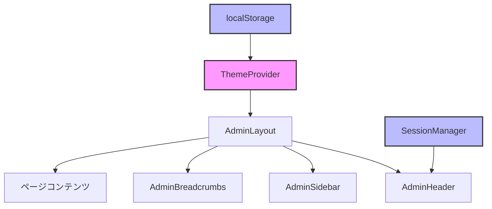

# 📚 管理画面レイアウト実装ガイド

**作成日**: 2025-08-26  
**対象者**: 初級〜中級エンジニア  
**目的**: Material UIとNext.js 15で作る管理画面の実装を学ぶ

---

## 🎯 このドキュメントで学べること

1. **Next.js 15 App Router**での管理画面構築
2. **Material UI**と**Tailwind CSS**の併用方法
3. **レスポンシブデザイン**の実装
4. **ダークモード**の実装
5. **認証連携**とセキュリティ
6. **E2Eテスト**の書き方

---

## 📁 ディレクトリ構造と役割

```
secure-session-system/
├── 📂 app/                           # Next.js App Router
│   ├── 📂 admin/                     # 管理画面のルート
│   │   ├── 📄 layout.tsx             # 管理画面の共通レイアウト
│   │   ├── 📂 dashboard/
│   │   │   └── 📄 page.tsx           # ダッシュボード画面
│   │   ├── 📂 users/
│   │   │   └── 📄 page.tsx           # ユーザー管理画面
│   │   ├── 📂 posts/
│   │   │   └── 📄 page.tsx           # 投稿管理画面
│   │   ├── 📂 reports/
│   │   │   └── 📄 page.tsx           # レポート画面
│   │   └── 📂 settings/
│   │       └── 📄 page.tsx           # 設定画面
│   │
├── 📂 components/                    # 再利用可能なコンポーネント
│   └── 📂 admin/                     # 管理画面専用コンポーネント
│       ├── 📄 AdminHeader.tsx        # ヘッダー（上部バー）
│       ├── 📄 AdminSidebar.tsx       # サイドバー（左側メニュー）
│       ├── 📄 AdminBreadcrumbs.tsx   # パンくずリスト
│       └── 📄 ThemeProvider.tsx      # テーマ（ダークモード）管理
│
├── 📂 tests/
│   └── 📂 e2e/
│       └── 📄 admin-layout.spec.ts   # E2Eテスト
│
└── 📂 lib/auth/                      # 既存の認証システム
    └── 📄 session-timeout.ts         # セッション管理（既存）
```

---

## 🏗️ アーキテクチャ解説

### 1. レイアウト構造

```
┌─────────────────────────────────────────────┐
│                  AdminHeader                 │ ← ヘッダー
├────────────┬────────────────────────────────┤
│            │                                 │
│            │     AdminBreadcrumbs            │ ← パンくず
│            │  ┌───────────────────────────┐ │
│   Admin    │  │                           │ │
│  Sidebar   │  │      ページコンテンツ      │ │ ← 各ページ
│            │  │     (children)            │ │
│    ←       │  │                           │ │
│  メニュー  │  └───────────────────────────┘ │
│            │                                 │
└────────────┴────────────────────────────────┘
```

### 2. データフローと状態管理



---

## 💻 実装詳細解説

### 1️⃣ AdminHeader.tsx - ヘッダーコンポーネント

**役割**: 画面上部の管理バー。管理者情報、ログアウト、ダークモード切り替え

```typescript
// 主要な機能
interface AdminHeaderProps {
  drawerWidth: number;          // サイドバーの幅
  isDrawerOpen: boolean;        // サイドバーの開閉状態
  onDrawerToggle: () => void;   // サイドバー開閉関数
  isDarkMode: boolean;          // ダークモードの状態
  onDarkModeToggle: () => void; // ダークモード切替関数
  adminName?: string;           // 管理者名
  adminRole?: string;           // 管理者権限
}
```

**実装のポイント**:
- 📱 **レスポンシブ対応**: モバイルではハンバーガーメニュー表示
- 🔐 **ログアウト処理**: 既存の認証システムと連携
- 🌙 **ダークモード**: スイッチで即座に切り替え
- 👤 **プロファイルメニュー**: アバター＋ドロップダウン

### 2️⃣ AdminSidebar.tsx - サイドバーコンポーネント

**役割**: 左側のナビゲーションメニュー

```typescript
const menuItems = [
  {
    title: 'ダッシュボード',
    icon: <Dashboard />,
    href: '/admin/dashboard',
  },
  {
    title: 'ユーザー管理',
    icon: <People />,
    href: '/admin/users',
    children: [  // 子メニューを持つ場合
      { title: 'ユーザー一覧', ... },
      { title: 'セッション管理', ... },
    ],
  },
  // ... 他のメニュー項目
];
```

**実装のポイント**:
- 📂 **階層メニュー**: 親子関係のあるメニューに対応
- 🎯 **アクティブ状態**: 現在のページをハイライト
- 💾 **状態保存**: 開閉状態をlocalStorageに保存
- 🎨 **アニメーション**: スムーズな開閉アニメーション

### 3️⃣ ThemeProvider.tsx - テーマ管理

**役割**: アプリ全体のテーマ（ライト/ダーク）を管理

```typescript
// ライトテーマの設定例
const lightTheme = createTheme({
  palette: {
    mode: 'light',
    primary: { main: '#1976d2' },
    background: {
      default: '#f5f5f5',
      paper: '#ffffff',
    },
  },
});

// ダークテーマの設定例
const darkTheme = createTheme({
  palette: {
    mode: 'dark',
    primary: { main: '#90caf9' },
    background: {
      default: '#121212',
      paper: '#1e1e1e',
    },
  },
});
```

**実装のポイント**:
- 🎨 **Material UI Theme**: MUIのテーマシステムを活用
- 💾 **設定の永続化**: localStorageで設定を保存
- 🖥️ **システム設定対応**: OSのダークモード設定を検知
- ⚡ **SSR対応**: サーバーサイドレンダリング時のエラーを防ぐ

### 4️⃣ AdminBreadcrumbs.tsx - パンくずリスト

**役割**: 現在地を示すナビゲーション

```typescript
// URLから自動的にパンくずを生成
// /admin/users/sessions → ホーム > ユーザー管理 > セッション管理

const pathLabelMap = {
  admin: 'Admin',
  dashboard: 'ダッシュボード',
  users: 'ユーザー管理',
  sessions: 'セッション管理',
  // ... 他のマッピング
};
```

**実装のポイント**:
- 🔄 **自動生成**: URLパスから自動的に生成
- 🏷️ **ラベルマッピング**: 英語のパスを日本語に変換
- 🔗 **ナビゲーション**: クリックで該当ページに移動

### 5️⃣ app/admin/layout.tsx - メインレイアウト

**役割**: すべての管理画面ページで共通のレイアウトを提供

```typescript
const AdminLayout = ({ children }) => {
  return (
    <AdminThemeProvider>           {/* テーマを提供 */}
      <Box sx={{ display: 'flex' }}>
        <AdminHeader />             {/* ヘッダー */}
        <AdminSidebar />            {/* サイドバー */}
        <Box component="main">
          <AdminBreadcrumbs />      {/* パンくず */}
          {children}                {/* ページコンテンツ */}
        </Box>
      </Box>
    </AdminThemeProvider>
  );
};
```

---

## 🔄 動作フロー

### ユーザーが管理画面にアクセスした時の流れ

1. **初回アクセス**
   ```
   ユーザー → /admin/dashboard にアクセス
   ↓
   layout.tsx が読み込まれる
   ↓
   ThemeProvider がテーマ設定を初期化
   ↓
   localStorageから以前の設定を復元
   ↓
   ヘッダー、サイドバー、コンテンツを表示
   ```

2. **メニュークリック時**
   ```
   サイドバーのメニューをクリック
   ↓
   URLが変更される（例: /admin/users）
   ↓
   パンくずリストが自動更新
   ↓
   アクティブメニューがハイライトされる
   ↓
   新しいページコンテンツが表示される
   ```

3. **ダークモード切り替え時**
   ```
   ダークモードスイッチをクリック
   ↓
   ThemeProviderが新しいテーマを適用
   ↓
   localStorageに設定を保存
   ↓
   全コンポーネントが即座に新テーマで再描画
   ```

4. **ログアウト時**
   ```
   プロファイルメニューからログアウトを選択
   ↓
   /api/auth/logout にPOSTリクエスト
   ↓
   セッションをクリア
   ↓
   ログインページにリダイレクト
   ```

---

## 📱 レスポンシブデザインの仕組み

### ブレークポイント

```typescript
// Material UIのブレークポイント
xs: 0px     // モバイル
sm: 600px   // タブレット
md: 900px   // 小さいデスクトップ
lg: 1200px  // デスクトップ
xl: 1536px  // 大画面
```

### デバイス別の動作

| デバイス | サイドバー | ヘッダー | 特徴 |
|---------|-----------|----------|------|
| **モバイル** | オーバーレイ表示 | ハンバーガーメニュー | タップで開閉 |
| **タブレット** | オーバーレイ表示 | ハンバーガーメニュー | より広い表示エリア |
| **デスクトップ** | 常時表示（折りたたみ可） | フル表示 | すべての機能を表示 |

---

## 🧪 テストの実装

### E2Eテストの構成

```typescript
test.describe('Admin Layout Tests', () => {
  // 1. ヘッダー表示テスト
  test('should display admin header correctly', ...);
  
  // 2. サイドバー機能テスト
  test('should handle sidebar toggle functionality', ...);
  
  // 3. レスポンシブテスト
  test('should handle responsive design on mobile', ...);
  
  // 4. ダークモードテスト
  test('should handle dark mode toggle', ...);
  
  // 5. ナビゲーションテスト
  test('should navigate between admin pages', ...);
});
```

### テストのポイント

- ✅ **要素の存在確認**: 各コンポーネントが表示されているか
- ✅ **インタラクション**: クリック、トグルが正しく動作するか
- ✅ **レスポンシブ**: 画面サイズ変更時の挙動
- ✅ **状態の永続化**: リロード後も設定が保持されるか

---

## 🔐 セキュリティ考慮事項

1. **認証チェック**
   - すべての管理画面ページで認証状態を確認
   - 未認証の場合はログインページにリダイレクト

2. **CSRF対策**
   - ログアウト時にCSRFトークンを送信
   - X-Requested-Withヘッダーを付与

3. **XSS対策**
   - Material UIコンポーネントを使用（自動エスケープ）
   - dangerouslySetInnerHTMLは使用しない

4. **セッション管理**
   - 既存のセッションタイムアウト機能と連携
   - 30分のアイドルタイムアウト

---

## 💡 開発のヒント

### よくある実装パターン

1. **新しいページの追加**
   ```bash
   # 1. ページディレクトリを作成
   mkdir app/admin/new-page
   
   # 2. page.tsxを作成
   touch app/admin/new-page/page.tsx
   ```

2. **メニュー項目の追加**
   ```typescript
   // AdminSidebar.tsxのmenuItemsに追加
   {
     title: '新機能',
     icon: <NewIcon />,
     href: '/admin/new-page',
   }
   ```

3. **カスタムテーマカラーの追加**
   ```typescript
   // ThemeProvider.tsxでカスタマイズ
   const customTheme = createTheme({
     palette: {
       primary: { main: '#好きな色' },
     },
   });
   ```

---

## 🚀 次のステップ

1. **機能拡張のアイデア**
   - 通知システムの追加
   - リアルタイムダッシュボード
   - 多言語対応

2. **パフォーマンス最適化**
   - コンポーネントの遅延読み込み
   - 画像の最適化
   - キャッシュ戦略

3. **アクセシビリティ向上**
   - キーボードナビゲーション
   - スクリーンリーダー対応
   - 高コントラストモード

---

## 📚 参考リンク

- [Next.js App Router](https://nextjs.org/docs/app)
- [Material UI Documentation](https://mui.com/)
- [Playwright Testing](https://playwright.dev/)
- [Tailwind CSS](https://tailwindcss.com/)

---

## 🎓 学習のポイント

このプロジェクトから学べる重要な概念：

1. **コンポーネント設計**: 再利用可能で保守しやすい設計
2. **状態管理**: Context APIとlocalStorageの使い分け
3. **レスポンシブデザイン**: デバイスに応じた最適な表示
4. **テスト駆動開発**: E2Eテストで品質を保証
5. **セキュリティ**: 認証・認可の実装

---

*このドキュメントは、初級〜中級エンジニアが管理画面の実装を理解し、自分でも実装できるようになることを目的としています。*