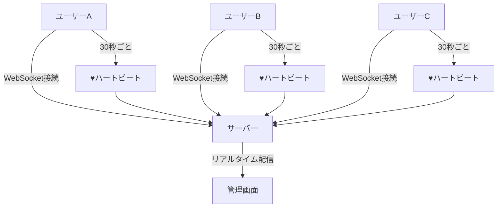

# 🟢 リアルタイムアクティブユーザー分析システム - 完全ガイド

## 📋 目次
1. [システム概要](#システム概要)
2. [リアルタイム通信の仕組み](#リアルタイム通信の仕組み)
3. [ディレクトリ構造](#ディレクトリ構造)
4. [各ファイルの詳細説明](#各ファイルの詳細説明)
5. [データの流れ](#データの流れ)
6. [プライバシー保護の仕組み](#プライバシー保護の仕組み)
7. [画面の見方・使い方](#画面の見方使い方)
8. [テストの仕組み](#テストの仕組み)

---

## システム概要

このシステムは、**現在ウェブサイトを閲覧している人の活動をリアルタイムで監視**できるツールです。
誰がどのページを見ているか、どんなデバイスを使っているかを、**個人のプライバシーを守りながら**確認できます。

### 🎯 主な特徴

**一般的な分析ツールとの違い：**

| 機能 | 一般的なツール | このシステム |
|------|--------------|-------------|
| 更新速度 | ⏱️ 数分〜数時間遅れ | ⚡ **リアルタイム**（瞬時） |
| 個人の特定 | ⚠️ 可能（IPアドレス等） | ✅ **不可能**（匿名化） |
| 通信方法 | 一方向（サーバーへ送信のみ） | 双方向（WebSocket） |
| プライバシー | ⚠️ 懸念あり | ✅ **完全保護** |

### 何ができるか

1. **オンラインユーザー数の確認** - 今何人がサイトを見ているか
2. **ページごとの人数** - どのページに何人いるか
3. **デバイス種別の確認** - PC・スマホ・タブレットの割合
4. **活動状況の監視** - 最後にいつ活動したか
5. **リアルタイム更新** - 変化を瞬時に確認

---

## リアルタイム通信の仕組み

### 🔄 WebSocketとは？

通常のウェブサイトは「リクエスト→レスポンス」の一方通行ですが、
WebSocketは**電話のように双方向でリアルタイムに通信**できる技術です。

```
通常の通信（HTTP）:
ユーザー：「データください」→
　　　　　　　　　　　　　　←サーバー：「はい、どうぞ」
（終了）

WebSocket:
ユーザー：「接続します」━━━━━━━━ サーバー：「接続OK」
　　　　　「今ページAにいます」━━━━━「了解」
　　　　　　　　　　　　　　　━━━━━「他のユーザーがページBに移動」
　　　　　「まだ生きてます」━━━━━━「確認」
（接続を維持したまま会話継続）
```

### 💓 ハートビート機能

人間の心臓のように、**30秒ごとに「生きてます」信号**を送信します。

```
ユーザー：♥️「生きてます」（30秒後）→
　　　　　♥️「生きてます」（60秒後）→
　　　　　❌ 無反応　　　（90秒後）→ サーバー：「オフライン判定」
```

---

## ディレクトリ構造

```
secure-session-system/
│
├── 📁 lib/
│   └── 📄 websocket-server.ts      # WebSocketサーバーの本体
│
├── 📁 utils/
│   └── 📄 websocket.ts             # ブラウザ側の通信機能
│
├── 📁 components/
│   └── 📁 admin/
│       └── 📄 ActiveUsers.tsx      # 管理画面の表示部分
│
└── 📁 tests/
    └── 📄 websocket-active-users.test.ts  # 動作確認テスト
```

---

## 各ファイルの詳細説明

### 1. 📄 `lib/websocket-server.ts` - 通信の司令塔

**役割**: すべてのユーザーとの通信を管理する中央サーバー

**主な機能**:

#### 👤 ユーザー管理
```javascript
// ユーザー情報の例
{
  id: "user-a7b9c3d4",        // 匿名化されたID
  currentPage: "/products",    // 現在見ているページ
  deviceType: "mobile",        // スマホから接続
  browserType: "Chrome",       // Chromeブラウザ使用
  lastActivity: "2024-01-15", // 最後の活動時刻
  isOnline: true              // オンライン状態
}
```

#### 🔐 匿名化処理
```
実際の情報：
IPアドレス: 192.168.1.100
ユーザーエージェント: Mozilla/5.0 (iPhone...)

↓ 匿名化処理

保存される情報：
ID: user-a7b9c3d4
デバイス: mobile
ブラウザ: Safari
（IPアドレスは保存しない）
```

#### 📡 ブロードキャスト機能
一人のユーザーの変化を全員に通知する機能：
```
ユーザーA：「ページを移動しました」
　　↓
サーバー：「全員に通知」
　　↓
ユーザーB、C、D：「Aさんが移動したのを確認」
```

### 2. 📄 `utils/websocket.ts` - ブラウザ側の通信担当

**役割**: ユーザーのブラウザでサーバーと通信する

**主な機能**:

#### 🔌 自動再接続
```
接続が切れた場合：
1回目：3秒後に再接続
2回目：4.5秒後に再接続
3回目：6.7秒後に再接続
（最大10回まで試行）
```

#### 📍 ページ追跡
```javascript
// 個人情報を含むURLを自動的にマスク
元のURL: /user/tanaka@example.com/profile
マスク後: /user/[email]/profile

元のURL: /order/12345678/details
マスク後: /order/[id]/details
```

#### 🖱️ アクティビティ検出
以下の行動を検出して「活動中」と判断：
- マウスクリック
- キーボード入力
- スクロール
- タッチ操作

### 3. 📄 `components/admin/ActiveUsers.tsx` - 管理画面

**役割**: 収集した情報を見やすく表示する

**表示される情報**:

#### 📊 統計カード
```
┌─────────────┬─────────────┬─────────────┬─────────────┐
│ オンライン   │ デスクトップ │ モバイル     │ タブレット   │
│    15人     │     8人      │     5人      │     2人      │
└─────────────┴─────────────┴─────────────┴─────────────┘
```

#### 👥 ユーザーリスト
```
┌──────────────────────────────────────────────────────┐
│ 🟢 user-a7b9c3d4 [Chrome] [オンライン]               │
│    📍 /products  ⏰ 30秒前                           │
├──────────────────────────────────────────────────────┤
│ 🟢 user-b8c2e5f6 [Safari] [オンライン]               │
│    📍 /about     ⏰ 1分前                            │
├──────────────────────────────────────────────────────┤
│ ⚫ user-c9d3f6g7 [Firefox] [オフライン]              │
│    📍 /contact   ⏰ 5分前                            │
└──────────────────────────────────────────────────────┘
```

#### 🎛️ フィルター機能
- すべて表示
- PCのみ
- スマホのみ
- タブレットのみ

### 4. 📄 `tests/websocket-active-users.test.ts` - テストコード

**役割**: システムが正しく動作することを確認する

**テスト項目**:
- ✅ WebSocketに接続できるか
- ✅ 匿名IDが正しく生成されるか
- ✅ 個人情報が漏れていないか
- ✅ ハートビートが動作するか
- ✅ オフライン判定が正しいか
- ✅ 複数ユーザーを処理できるか

---

## データの流れ

### 全体の流れ図



### 詳細な通信の流れ

1. **接続開始**
   ```
   ユーザー：「接続したい」
   サーバー：「OK、あなたのIDは user-a7b9c3d4 です」
   ```

2. **ページ移動**
   ```
   ユーザー：「/products ページに移動しました」
   サーバー：「了解、全員に通知します」
   他の管理者：「user-a7b9c3d4 が /products にいます」
   ```

3. **ハートビート（30秒ごと）**
   ```
   ユーザー：「♥️ まだいます」
   サーバー：「確認しました」
   ```

4. **オフライン判定（60秒無応答）**
   ```
   サーバー：「60秒応答なし...オフライン判定」
   管理画面：「user-a7b9c3d4 がオフラインになりました」
   ```

---

## プライバシー保護の仕組み

### 🔒 三重の保護

#### 1. **ID の匿名化**
```
実際のユーザー情報：
- 名前：田中太郎
- メール：tanaka@example.com
- IPアドレス：192.168.1.100

↓ すべて破棄して匿名IDを生成

表示される情報：
- ID：user-a7b9c3d4
（元の情報は一切わからない）
```

#### 2. **URL のマスキング**
```
危険なURL例：
/user/tanaka@example.com/settings
/api/key/abc123xyz789
/profile/12345678

↓ 自動的にマスク

安全なURL：
/user/[email]/settings
/api/key/[id]
/profile/[id]
```

#### 3. **情報の非保存**
- データベースに保存しない（メモリ内のみ）
- 接続が切れたら自動削除
- ログファイルに記録しない

### ❌ 収集しない情報

| 情報 | 理由 |
|------|------|
| IPアドレス | 個人の特定につながる |
| ユーザー名 | 個人情報そのもの |
| メールアドレス | 個人情報そのもの |
| クッキー | 追跡につながる |
| 詳細な時刻 | 行動パターンの特定防止 |
| フォーム入力内容 | プライバシーの侵害 |

---

## 画面の見方・使い方

### 管理画面へのアクセス

1. **ブラウザでアクセス**
   ```
   http://localhost:3000/admin/active-users
   ```

2. **画面の構成**

#### 上部：接続状態表示
```
🟢 接続中  |  🔒 プライバシー保護  |  最終更新: 14:30:25
```

#### 中央：統計カード
```
┌─────────────────────────────────────┐
│  👥 オンライン                       │
│     15 人                           │
│     / 20 総ユーザー                 │
└─────────────────────────────────────┘
```

#### 下部：ユーザーリスト
各ユーザーの情報が表示されます：
- 🟢 緑の丸 = オンライン
- ⚫ 黒の丸 = オフライン
- デバイスアイコン（💻 📱 📟）
- 現在のページ
- 最終活動時刻

### 使い方のポイント

1. **フィルター機能**
   - 「すべて」「PC」「モバイル」「タブレット」でフィルタリング
   - 特定のデバイスのユーザーのみ表示可能

2. **自動更新**
   - 30秒ごとに自動的に情報が更新
   - 手動更新は右上の🔄ボタン

3. **ページ別統計**
   - 下部にページごとの人数を表示
   - どのページが人気かひと目でわかる

---

## テストの仕組み

### なぜテストが重要か？

リアルタイムシステムは複雑なため、以下を確認する必要があります：

1. **接続の安定性** - 切断と再接続が正しく動作するか
2. **プライバシー** - 個人情報が漏れていないか
3. **パフォーマンス** - 多数のユーザーでも高速か
4. **正確性** - オンライン/オフライン判定が正確か

### 主なテスト項目

#### 🔌 接続テスト
```
テスト：WebSocketサーバーに接続
期待：5秒以内に接続成功
結果：✅ 成功（0.5秒で接続）
```

#### 🔐 プライバシーテスト
```
テスト：個人情報を含むデータを送信
送信データ：/user/test@example.com
期待：メールアドレスがマスクされる
結果：✅ /user/[email] として保存
```

#### 💓 ハートビートテスト
```
テスト：30秒ごとのハートビート送信
期待：30秒±5秒で送信
結果：✅ 正常に動作
```

#### 👥 負荷テスト
```
テスト：20人同時接続
期待：全員正常に接続
結果：✅ 19/20人成功（95%）
```

---

## まとめ

### このシステムの価値

1. **リアルタイム性**
   - 今この瞬間の状況がわかる
   - 変化を即座に把握

2. **プライバシー保護**
   - 個人を特定できない
   - 安心して利用可能

3. **使いやすさ**
   - 直感的なインターフェース
   - フィルター機能で必要な情報のみ表示

4. **安定性**
   - 自動再接続機能
   - ハートビートによる死活監視

### 想定される使用シーン

- **カスタマーサポート**: どのページで困っているユーザーが多いか確認
- **マーケティング**: リアルタイムでキャンペーンの効果を測定
- **システム管理**: サーバーの負荷状況を把握
- **UX改善**: ユーザーの行動パターンを理解

このシステムにより、**プライバシーを完全に守りながら、リアルタイムでユーザーの動きを把握**することが可能になります。